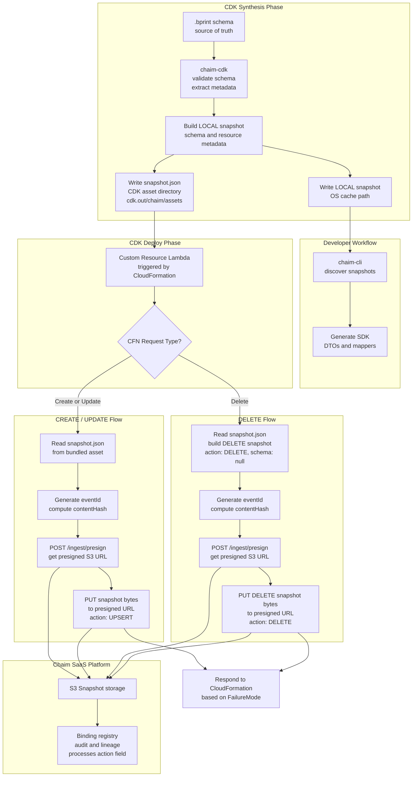

# AI Agent Context: chaim-cdk

**Purpose**: Structured context for AI agents to understand and work with the chaim-cdk codebase.

**Package**: `@chaim-tools/cdk-lib`  
**Version**: 0.1.0  
**License**: Apache-2.0

---

## Project Overview

The chaim-cdk is a **pnpm monorepo** containing AWS CDK L2 constructs for binding data stores to Chaim schemas. It captures schema and metadata at **synth time** (LOCAL snapshot) and publishes to the **Chaim SaaS platform** at **deploy time** (PUBLISHED).

> **Mental model (LOCAL + PUBLISHED)**:
> - **LOCAL snapshot**: Written during synthesis (runs for both `cdk synth` and `cdk deploy`). Stored in OS cache. Used by CLI for code generation.
> - **PUBLISHED snapshot**: Sent to Chaim SaaS at deploy-time by the Lambda custom resource. Contains `eventId` and `contentHash` for audit/tracking.
> 
> Chaim operates entirely out-of-band: zero impact on your application's request path, no runtime overhead, no sidecars, no instrumentation.

### Key Capabilities

- **ChaimDynamoDBBinder**: CDK construct for binding DynamoDB tables to `.bprint` schemas
- **LOCAL Snapshots**: Written to OS cache during synth for CLI consumption
- **PUBLISHED Snapshots**: Sent to Chaim SaaS at deploy-time via Lambda custom resource
- **Extensible Architecture**: Abstract base class supports future data store types (e.g., RDS, Object)
- **Large Payload Support**: S3 presigned upload avoids API Gateway payload limits
- **Schema Validation**: Validates `.bprint` files using `@chaim-tools/chaim-bprint-spec`
- **Metadata Capture**: Captures schema, resource configuration (keys, indexes, TTL, streams, encryption), and cloud account details
- **Secure Ingestion**: API key authentication over HTTPS; credentials read from Secrets Manager at deploy time

> **Implementation status:** DynamoDB binder is production-ready. Aurora/RDS/DocumentDB binders are planned (see Coming Soon).

---

## Related Packages

| Package | Relationship | Purpose |
|---------|-------------|---------|
| `@chaim-tools/chaim-bprint-spec` | **Dependency** | Schema format definition, validation, TypeScript types |
| `chaim-cli` | **Consumer** | Reads LOCAL snapshot files from OS cache for SDK code generation |

**Data flow**:



**Data Flow Summary by Operation:**

| Operation | S3 Upload | API Calls | Snapshot Action Field |
|-----------|-----------|-----------|----------------------|
| **CREATE / UPDATE** | ✅ Full snapshot (with schema) | `/ingest/presign` → PUT to S3 | `action: "UPSERT"` |
| **DELETE** | ✅ DELETE snapshot (schema: null) | `/ingest/presign` → PUT to S3 | `action: "DELETE"` |


## Scope

This repository (`chaim-cdk`) is the **AWS CDK (CloudFormation) implementation** of Chaim ingestion.

- It is intentionally **AWS-specific** (DynamoDB, CloudFormation Custom Resource, Secrets Manager, S3 presigned URLs).
- Other cloud providers and on-prem deployment integrations will live in **separate repositories**.
- All provider repos must remain **contract-compatible** with the Chaim ingest plane:
  - POST /ingest/presign → PUT snapshot bytes (with action field) to S3
  - resourceId + contentHash deduplication
  - authenticated requests (API key credentials)
  - Snapshots include `action` field: "UPSERT" or "DELETE"

---

## Technology Stack

| Component | Technology |
|-----------|------------|
| Language | TypeScript 5.x |
| Package Manager | pnpm 8+ (monorepo) |
| Runtime | Node.js 20+ |
| Infrastructure | AWS CDK v2 |
| AWS Services | DynamoDB, Lambda, Secrets Manager, S3 (presigned URLs) |
| Testing | Vitest |
| Code Quality | ESLint, TypeScript strict mode |

---

## Repository Structure

| Directory | Purpose |
|-----------|---------|
| `src/binders/` | CDK constructs - base class and data store implementations |
| `src/lambda-handler/` | Canonical Lambda handler for deploy-time ingestion |
| `src/services/` | Utilities for schema loading, caching, and path resolution |
| `src/types/` | TypeScript interfaces and type definitions |
| `src/config/` | API endpoints and configuration constants |
| `packages/cdk-lib/` | Published npm package |
| `example/` | Usage examples and sample `.bprint` schemas |
| `test/` | Unit and integration tests |

> See **Key Files Reference** section below for specific file details.

---

## Architecture

### Lambda Handler (Canonical Implementation)

The ingestion Lambda handler is located at `src/lambda-handler/handler.js`. This is the **single source of truth** for the ingestion workflow.

**Key characteristics:**
- Written in JavaScript (no compilation during synth)
- Reads `./snapshot.json` from bundled asset directory
- Generates `eventId` (UUID v4) at runtime
- Computes `contentHash` (SHA-256 of snapshot bytes)
- Implements presigned upload flow

**Ingestion Flow (Create/Update):**
1. Read snapshot.json from bundled asset
2. Generate eventId using `crypto.randomUUID()`
3. Compute contentHash as SHA-256 of snapshot bytes
4. POST `/ingest/presign` → get presigned S3 URL
5. PUT snapshot bytes (with `action: "UPSERT"`) to presigned URL
6. Ingest service processes snapshot from S3 and marks entity as active

**Ingestion Flow (Delete):**
1. Read snapshot.json from bundled asset
2. Build DELETE snapshot: set `action: "DELETE"` and `schema: null`
3. Generate eventId using `crypto.randomUUID()`
4. Compute contentHash as SHA-256 of DELETE snapshot bytes
5. POST `/ingest/presign` → get presigned S3 URL
6. PUT DELETE snapshot bytes to presigned URL
7. Ingest service processes DELETE snapshot from S3 and marks entity as deleted

### Extensible Base Class Design

```
BaseChaimBinder (abstract)
├── extractMetadata()           # Abstract - implemented by subclasses
├── buildLocalSnapshot()        # Synth-time: builds LOCAL payload for CLI
├── writeLocalSnapshotToDisk()  # Writes to OS cache (~/.chaim/cache/snapshots/)
├── writeSnapshotAsset()        # Writes to cdk.out/chaim/assets/ for Lambda bundling
├── deployIngestionResources()  # Shared - Lambda + custom resource for deploy-time
│
└── ChaimDynamoDBBinder (concrete)
    └── extractMetadata()       # DynamoDB-specific metadata extraction

Future extensions (not yet implemented):
├── ChaimAuroraBinder
├── ChaimRDSBinder
└── ChaimDocumentDBBinder
```

### Credential Security Model

> **Synth never reads secret values.** The Secret ARN/name is captured as a reference only. The deploy-time Lambda reads Secrets Manager and signs outbound API requests. No credentials are logged or included in synthesized templates/assets.

| Phase | Credential Handling |
|-------|---------------------|
| **Synth** | Captures Secret ARN reference only; no secret values read |
| **Deploy** | Lambda reads Secrets Manager, signs API requests |

### Snapshot Creation Flow

**During `cdk synth` or `cdk deploy` (constructor execution):**
1. Validate credential reference (ARN/name format, not secret value)
2. Load and validate `.bprint` schema
3. Extract data store metadata (subclass)
4. Compute stable resource key (physical name > logical ID > construct path)
5. Generate resourceId with collision handling: `{resourceName}__{entityName}[__N]`
6. **Write LOCAL snapshot** → OS cache (OVERWRITE on each synth)
7. **Write snapshot.json + handler.js** → `cdk.out/chaim/assets/{stackName}/{resourceId}/`
8. Deploy ingestion Lambda + custom resource (uses asset directory)

**During `cdk deploy` (Lambda execution):**

**For Create/Update (UPSERT):**
1. Lambda reads snapshot from bundled `./snapshot.json`
2. Generate `eventId` (UUID v4) at runtime
3. Compute `contentHash` = SHA-256(snapshot bytes)
4. POST /ingest/presign (get presigned URL)
5. PUT snapshot bytes (with `action: "UPSERT"`) to presigned URL
6. Respond to CloudFormation based on FailureMode

**For Delete:**
1. Lambda reads snapshot from bundled `./snapshot.json`
2. Build DELETE snapshot: set `action: "DELETE"` and `schema: null`
3. Generate `eventId` (UUID v4) at runtime
4. Compute `contentHash` = SHA-256(DELETE snapshot bytes)
5. POST /ingest/presign (get presigned URL)
6. PUT DELETE snapshot bytes to presigned URL
7. Respond to CloudFormation based on FailureMode

---

## API Endpoints Configuration

### Default Base URL

The default Chaim API base URL is defined in `src/config/chaim-endpoints.ts`:

```typescript
export const DEFAULT_CHAIM_API_BASE_URL = 'https://ingest.chaim.co';
```

**Override via:**
- CDK context: `chaimApiBaseUrl`
- Environment variable: `CHAIM_API_BASE_URL`

### Endpoints

| Endpoint | Method | Purpose |
|----------|--------|---------|
| `/ingest/presign` | POST | Request presigned S3 upload URL for both UPSERT and DELETE snapshots |

**Note**: Both UPSERT and DELETE operations use the same presigned upload flow. The `action` field in the snapshot payload determines whether the entity is created/updated or marked as deleted.

---

## Snapshot Locations

### LOCAL Snapshots (OS Cache)

LOCAL snapshots are written to a **global OS cache** for CLI consumption. This allows the CLI to work from any directory without requiring access to the CDK project.

**Default locations:**
- macOS/Linux: `~/.chaim/cache/snapshots/`
- Windows: `%LOCALAPPDATA%/chaim/cache/snapshots/`

**Override:** Set `CHAIM_SNAPSHOT_DIR` environment variable.

**Directory Structure:**
```
~/.chaim/cache/snapshots/
└── aws/
    └── {accountId}/
        └── {region}/
            └── {stackName}/
                └── {datastoreType}/
                    └── {resourceId}.json
```

### Lambda Asset Directory (CDK Asset)

Lambda reads its snapshot from a bundled asset directory, **NOT** from environment variables or OS cache.

**Location:** `<cdkRoot>/cdk.out/chaim/assets/{stackName}/{resourceId}/`

**Contents:**
- `snapshot.json` - The snapshot payload
- `index.js` - Copy of canonical handler from `src/lambda-handler/handler.js`

This directory is discovered by walking up from the module to find `cdk.json`, not by using `process.cwd()`. Asset directories are **isolated per stack+resourceId** and **overwritten on each synth**.

---

## Core Construct: ChaimDynamoDBBinder

CDK construct for binding a `.bprint` schema to a DynamoDB table and publishing to Chaim SaaS.

```typescript
import { ChaimDynamoDBBinder, ChaimCredentials, TableBindingConfig, FailureMode } from '@chaim-tools/cdk-lib';
import * as dynamodb from 'aws-cdk-lib/aws-dynamodb';

const table = new dynamodb.Table(this, 'UsersTable', {
  partitionKey: { name: 'userId', type: dynamodb.AttributeType.STRING },
});

// Using Secrets Manager - failureMode defaults to BEST_EFFORT
const config = new TableBindingConfig(
  'my-app',
  ChaimCredentials.fromSecretsManager('chaim/api-credentials')
);

new ChaimDynamoDBBinder(this, 'UserSchema', {
  schemaPath: './schemas/user.bprint',
  table,
  config,
});

// Using direct credentials with STRICT mode (rolls back on failure)
const strictConfig = new TableBindingConfig(
  'my-app',
  ChaimCredentials.fromApiKeys(
    process.env.CHAIM_API_KEY!,
    process.env.CHAIM_API_SECRET!
  ),
  FailureMode.STRICT
);

new ChaimDynamoDBBinder(this, 'UserSchema', {
  schemaPath: './schemas/user.bprint',
  table,
  config: strictConfig,
});
```

### Single-Table Design Pattern

For single-table design with multiple entities, create **one** `TableBindingConfig` and share it:

```typescript
const singleTable = new dynamodb.Table(this, 'SingleTable', {
  partitionKey: { name: 'PK', type: dynamodb.AttributeType.STRING },
  sortKey: { name: 'SK', type: dynamodb.AttributeType.STRING },
});

// Create config ONCE for the table
const tableConfig = new TableBindingConfig(
  'my-app',
  ChaimCredentials.fromSecretsManager('chaim/api-credentials')
);

// Share config across all entities in the table
new ChaimDynamoDBBinder(this, 'UserBinding', {
  schemaPath: './schemas/user.bprint',
  table: singleTable,
  config: tableConfig,  // Same config
});

new ChaimDynamoDBBinder(this, 'OrderBinding', {
  schemaPath: './schemas/order.bprint',
  table: singleTable,
  config: tableConfig,  // Same config
});

new ChaimDynamoDBBinder(this, 'ProductBinding', {
  schemaPath: './schemas/product.bprint',
  table: singleTable,
  config: tableConfig,  // Same config
});
```

**Validation:** The construct validates that all bindings to the same table use the same `appId` and `credentials`. This ensures consistency at the Chaim platform level.

### ChaimDynamoDBBinderProps

| Property | Type | Required | Description |
|----------|------|----------|-------------|
| `schemaPath` | string | Yes | Path to `.bprint` schema file |
| `table` | `ITable` | Yes | DynamoDB table to bind |
| `config` | `TableBindingConfig` | Yes | Binding configuration (appId, credentials, failureMode) |

### TableBindingConfig

Configuration object that encapsulates binding settings.

**Constructor:**
```typescript
new TableBindingConfig(
  appId: string,
  credentials: IChaimCredentials,
  failureMode?: FailureMode  // defaults to BEST_EFFORT
)
```

**Properties:**
- `appId` (readonly) - Application ID for Chaim SaaS
- `credentials` (readonly) - API credentials
- `failureMode` (readonly) - Failure handling mode

---

## Usage with chaim-cli

The CLI reads LOCAL snapshots from the OS cache:

```bash
# Generate all entities (newest snapshot by capturedAt)
chaim generate --package com.example.model

# Filter by stack name
chaim generate --stack MyStack --package com.example.model

# Override snapshot directory
chaim generate --snapshot-dir /custom/path --package com.example.model
```

---

## DynamoDB Metadata Captured

| Field | Description |
|-------|-------------|
| `tableName` | Table name |
| `tableArn` | Table ARN |
| `partitionKey` | Partition key attribute name |
| `sortKey` | Sort key attribute name (if composite key) |
| `globalSecondaryIndexes` | GSI configurations (name, keys, projection) |
| `localSecondaryIndexes` | LSI configurations (name, sort key, projection) |
| `ttlAttribute` | TTL attribute name (if enabled) |
| `streamEnabled` | Whether DynamoDB Streams is enabled |
| `streamViewType` | Stream view type (NEW_IMAGE, OLD_IMAGE, etc.) |
| `billingMode` | PAY_PER_REQUEST or PROVISIONED |
| `encryptionKeyArn` | KMS key ARN (if encrypted) |

---

## Snapshot Actions

Snapshots support two action types through the `action` field in `LocalSnapshotPayload`:

| Action | Description | Use Case | Schema Field |
|--------|-------------|----------|--------------|
| `UPSERT` | Create or update entity metadata | ChaimBinder added or updated | Full schema included |
| `DELETE` | Mark entity as deleted | ChaimBinder removed from stack | `schema: null` |

### UPSERT Snapshot Example

```json
{
  "schemaVersion": "1.0",
  "action": "UPSERT",
  "provider": "aws",
  "accountId": "123456789012",
  "resourceId": "customer__Payment",
  "datastoreType": "dynamodb",
  "schema": {
    "schemaVersion": 1.0,
    "entityName": "Payment",
    "description": "Payment transaction records",
    "primaryKey": { "partitionKey": "paymentId" },
    "fields": [...]
  },
  "dataStore": {
    "type": "dynamodb",
    "tableName": "CustomerTable",
    "tableArn": "arn:aws:dynamodb:us-east-1:123456789012:table/CustomerTable",
    "partitionKey": "pk"
  },
  "capturedAt": "2026-01-15T14:30:00Z"
}
```

### DELETE Snapshot Example

```json
{
  "schemaVersion": "1.0",
  "action": "DELETE",
  "provider": "aws",
  "accountId": "123456789012",
  "resourceId": "customer__Payment",
  "datastoreType": "dynamodb",
  "schema": null,
  "dataStore": {
    "type": "dynamodb",
    "tableName": "CustomerTable",
    "tableArn": "arn:aws:dynamodb:us-east-1:123456789012:table/CustomerTable",
    "partitionKey": "pk"
  },
  "capturedAt": "2026-01-15T20:45:00Z"
}
```

### Key Differences

- **DELETE snapshots** have `action: "DELETE"`
- **Schema is null** for DELETE (not needed for deletion)
- All **identifying fields** must be present (appId, resourceId, provider, accountId, region, stackName, datastoreType)
- **dataStore metadata** is included (for audit trail)
- Result: Entity marked as `state: "deleted"` in resource-metadata table

### Entity-Level Deletion

The system tracks **entities** (schemas) within resources (tables). Each entity gets its own metadata record:

**Single entity removal:**
- Remove one ChaimBinder from CDK code
- CloudFormation sends DELETE event for that custom resource
- Lambda sends DELETE snapshot with `resourceId: "{table}__{entity}"`
- Example: Remove Payment entity from customer table
- Result: `customer__Payment` marked as deleted, other entities remain active

**Multiple entities:**
- Each ChaimBinder creates its own CloudFormation custom resource
- Removing multiple bindings triggers separate DELETE events
- Each DELETE event uploads its own DELETE snapshot

### Backward Compatibility

- If `action` field is missing, defaults to `"UPSERT"` (backward compatible with v1.0 snapshots)
- Existing snapshots without the action field continue to work as UPSERT operations

---

## SaaS Ingestion Flow (Agent Contract)

### Goal
On every CloudFormation Create/Update/Delete, notify Chaim SaaS:
- **Create/Update**: Upload full snapshot (with `action: "UPSERT"`) via S3 presigned URL
- **Delete**: Upload DELETE snapshot (with `action: "DELETE"` and `schema: null`) via S3 presigned URL

### Non-Goals

The chaim-cdk package does NOT:
- Perform runtime data access or interception
- Enforce data policies at request time
- Scan existing cloud infrastructure
- Mutate customer data stores beyond declared CDK resources
- Persist customer data outside of Chaim ingestion workflows

### Sequence (runtime during CFN deployment)

**Create/Update (UPSERT):**
1. Lambda reads snapshot bytes from bundled `./snapshot.json`
2. Generate `eventId` (UUID v4) at runtime
3. Compute `contentHash` = SHA-256(snapshot bytes)
4. POST /ingest/presign (auth required) → get presigned S3 URL
5. PUT snapshot bytes (with `action: "UPSERT"`) to presigned URL
6. Ingest service processes snapshot and marks entity as active
7. Respond to CloudFormation based on FailureMode

**Delete:**
1. Lambda reads snapshot from bundled `./snapshot.json`
2. Build DELETE snapshot: `{ ...snapshot, action: "DELETE", schema: null, capturedAt: <new-timestamp> }`
3. Generate `eventId` (UUID v4) at runtime
4. Compute `contentHash` = SHA-256(DELETE snapshot bytes)
5. POST /ingest/presign (auth required) → get presigned S3 URL
6. PUT DELETE snapshot bytes to presigned URL
7. Ingest service processes DELETE snapshot and marks entity as deleted
8. Respond to CloudFormation based on FailureMode

### Invariants (must/never)
- MUST NOT send large snapshots inline to CloudFormation or API Gateway.
- MUST NOT log credentials or secrets.
- MUST return a small CFN response only (eventId + status).
- MUST be safe on CloudFormation retries.
- MUST store `eventId` in `PhysicalResourceId` and reuse on retry (same CFN RequestId = same eventId).

### Idempotency Model

| Key | Purpose | When Used |
|-----|---------|-----------|
| `resourceId + contentHash` | **Deduplication** - SaaS ignores uploads with identical content | Every UPSERT |
| `eventId` | **Audit trail** - Unique per CFN operation, stored in PhysicalResourceId | Tracking/lineage |
| `CloudFormation RequestId` | **Retry detection** - Same RequestId on retry triggers eventId reuse | CFN retries |

> **CloudFormation retry behavior:** On retry, the Lambda receives the same `RequestId`. The handler checks if `PhysicalResourceId` already contains an eventId and reuses it, ensuring the same eventId is submitted to SaaS. The SaaS treats duplicate eventId submissions as safe no-ops.

### Failure Modes

| Mode | Behavior |
|------|----------|
| `BEST_EFFORT` (default) | Log errors, return SUCCESS to CloudFormation |
| `STRICT` | Return FAILED to CloudFormation on any ingestion error |

---

## Development Commands

| Command | Purpose |
|---------|---------|
| `pnpm install` | Install all dependencies |
| `pnpm build` | Build all packages |
| `pnpm test` | Run test suite |
| `pnpm lint` | Run ESLint |
| `pnpm clean` | Clean build artifacts |

---

## Key Files Reference

| File | Purpose |
|------|---------|
| `src/lambda-handler/handler.js` | Canonical Lambda handler (presigned upload flow) |
| `src/binders/base-chaim-binder.ts` | Abstract base class with shared ingestion logic |
| `src/binders/chaim-dynamodb-binder.ts` | DynamoDB-specific implementation |
| `src/config/chaim-endpoints.ts` | Centralized API URLs and constants |
| `src/types/ingest-contract.ts` | API request/response type definitions |
| `src/types/snapshot-payload.ts` | LocalSnapshotPayload (with action field), context, and response types |
| `src/types/credentials.ts` | ChaimCredentials factory class |
| `src/types/failure-mode.ts` | FailureMode enum definition |
| `src/services/os-cache-paths.ts` | OS cache directory utilities |
| `src/services/cdk-project-root.ts` | CDK project root discovery |
| `src/services/snapshot-paths.ts` | Snapshot file path utilities |
| `src/services/stable-identity.ts` | Stable identity and collision handling |
| `src/services/schema-service.ts` | Schema loading and validation |
| `src/services/ingestion-service.ts` | Ingestion service utilities |

---

## IAM Permissions

### Lambda Execution Role

- `logs:CreateLogGroup`, `logs:CreateLogStream`, `logs:PutLogEvents`
- `secretsmanager:GetSecretValue` (if using Secrets Manager)

### Network Requirements

- Outbound HTTPS to Chaim API endpoints
- Outbound HTTPS to AWS S3 presigned URLs

---

**Note**: This document reflects the Chaim SaaS integration architecture. All binders require Chaim API credentials and publish to the Chaim platform via S3 presigned upload. LOCAL snapshots are written to the OS cache for CLI consumption.
